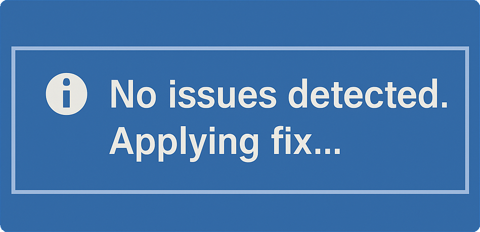

# [Not-A-Problem](https://not-a-problem.com)

> A blog (mostly) dedicated to the fine art of troubleshooting things that technically work just fine.

## About Us

Welcome to **Not-A-Problem** — your documentation playground:

- Part tech blog, part comedy of errors.
- A place to over-explain the obvious.
- And sometimes, a way to write down the obscure “non-problems” that somehow took three hours of Googling to figure out.

Think of it as a troubleshooting guide for the over-thinker, the perfectionist, or anyone who’s ever reinstalled an OS just because the desktop icons looked at them funny.

This blog doesn’t promise efficiency. It doesn’t even promise relevance. What it does promise is an archive of fixes, tweaks, and questionable decisions — carefully recorded so you don’t have to waste time wondering why on earth someone did that.

Because sometimes the only thing more satisfying than fixing what’s broken… is fixing what isn’t.

## Free to View

Everything is free to browse and read. Paid subscriptions and donations are welcome and appreciated, but we currently have no plans for exclusive benefits.

## Fresh Content, Delivered

Stay up to date with new content sent straight to your inbox! No more worrying about missing something because of a pesky algorithm or news feed.

## Non-Problems Not Guaranteed

Sometimes things need to be fixed because they are broken... Maybe that'll be what the subscription is for 🤔

---

Visit us at [not-a-problem.com](https://not-a-problem.com)